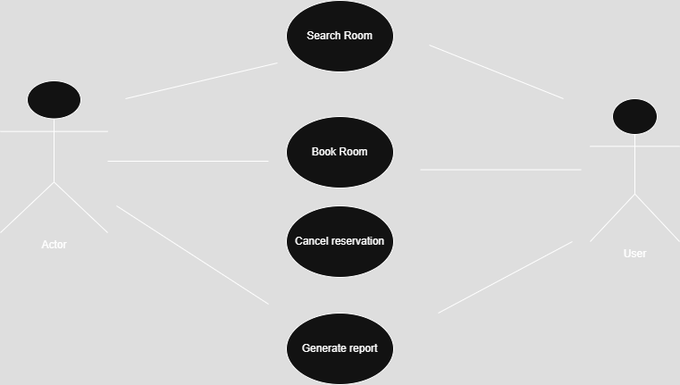

# Requirement Analysis in Software Development
This repository explores requirement analysis in software development, covering best practices, tools, and methodologies. It serves as a foundational resource for developers, project managers, and stakeholders involved in the software development lifecycle.
## What is Requirement Analysis?

Requirement Analysis is the process of identifying, documenting, and validating the needs and expectations of stakeholders for a software system. It is an essential step in the **Software Development Life Cycle (SDLC)** that ensures clear communication between developers and stakeholders, helping to create functional and efficient software.

Importance of Requirement Analysis:
- Prevents **miscommunication** between stakeholders and developers.
- Helps **define the scope** of a project before development starts.
- Reduces **costs** by catching issues early before implementation.

## Why is Requirement Analysis Important?

Requirement Analysis is crucial in SDLC because it ensures a software product meets the needs of its users. Here are three key reasons why it's important:

1. **Minimizes Project Risks**  
   - Helps identify potential challenges and prevents scope creep.
2. **Improves Efficiency**  
   - Ensures developers work with well-defined requirements, reducing unnecessary rework.
3. **Enhances Quality & User Satisfaction**  
   - Ensures software is designed to meet user needs, improving usability.

## Key Activities in Requirement Analysis

Requirement Analysis involves several key activities to ensure a project meets business needs:

- **Requirement Gathering** – Collecting requirements from stakeholders.
- **Requirement Elicitation** – Extracting necessary details via interviews, surveys, and brainstorming.
- **Requirement Documentation** – Organizing requirements in a structured format.
- **Requirement Analysis and Modeling** – Evaluating feasibility and creating models for visualization.
- **Requirement Validation** – Ensuring requirements are accurate, complete, and aligned with business goals.

  ## Types of Requirements

### Functional Requirements
Functional requirements define what the system **must do**. Example for a **Booking Management System**:
- Users should be able to **search and book rooms**.
- The system should **send confirmation emails** after booking.

### Non-functional Requirements
Non-functional requirements focus on **system performance and usability**. Examples:
- The system should handle **1000 concurrent users**.
- Booking response time should be **under 2 seconds**.

## Use Case Diagrams

Use Case Diagrams visually represent system interactions.

## Acceptance Criteria

Acceptance Criteria define the conditions a feature must meet before release.

### Example: Checkout Feature in Booking System
- Users must be able to **view the booking summary before payment**.
- The system should **accept multiple payment methods**.
- Booking confirmation should be **sent via email immediately** after successful payment.

